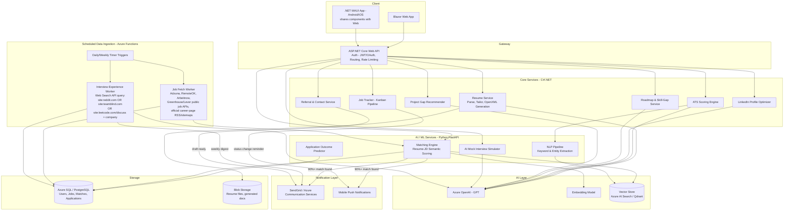

# CareerPathAI — System Architecture

An AI career copilot that analyzes your resume against target JDs, tracks a daily-refreshed feed of 90%+ matched jobs, auto-drafts tailored applications, builds a personalized 6-month roadmap, and keeps you plugged into your dream companies via referrals and interview-experience digests.

---

## 1. Architecture Diagram

---

## 2. Full Feature List

### Core (application engine)
- Resume upload/parsing (PDF/DOCX)
- Resume-to-JD gap analysis (semantic, not just keyword match)
- Auto-tailored resume version generator per JD (OpenXML/docx output)
- ATS Scoring Engine (title match, keyword density, formatting, section detection)
- Daily job-refresh pipeline, 90%+ match alerting
- Auto-draft application + one-click review-and-submit (no unauthorized auto-submission)

### Tracking & Organization
- **Job Tracker** — Kanban pipeline: Saved → Applied → OA → Interview → Offer → Rejected, with per-stage notes and dates
- **Dream Company Checklist** — target companies, visa-sponsor tag, application status, priority ranking
- **Referral & Contact Finder** — draft personalized outreach messages for contacts the user identifies via their own LinkedIn network/alumni tool (see compliance note in §5)

### Growth & Learning
- 6-month roadmap generator with checklist to-dos, linking out to curated DSA sheets (Striver's, NeetCode) and YouTube playlists — links only, no content hosting (copyright-safe)
- **Project Gap Recommender** — analyzes skill gaps vs. target JDs and suggests portfolio projects to close them (this is literally what we did manually for you — now productized)
- Weekly **Interview-Experience Newsletter** — LLM-summarized digest of publicly indexed posts about target companies, sourced via search API across Reddit, Blind, LeetCode Discuss, Glassdoor, Quora, with links back to original source (not full-text scraping)

### "Wow" AI Features
- **AI Mock Interview Simulator** — voice or text-based, generates company/role-specific questions, gives structured feedback (STAR-method scoring, technical depth check)
- **Application Outcome Predictor** — model trained on the user's own historical application data (stage reached vs. features like match %, resume version, referral used) to surface "what's actually moving the needle for you"
- **LinkedIn Profile Optimizer** — paste-in current headline/about/experience → AI rewrite suggestions scored against target-role keyword density
- **Explainable ATS Score** — not just a number; shows *why* (missing keywords, title mismatch, formatting flags) same way we've been doing manually
- **Keyword Radar** — visual gap chart: JD-required keywords vs. resume-present keywords, updated live as user edits
- **Skill Trajectory Simulator** — "if you learn X, your match rate against saved dream-company JDs increases by Y%"

---

## 3. Tech Stack

| Layer | Technology | Why |
|---|---|---|
| Web frontend | Blazor (Server or WASM) | C#-native, shares models/logic with backend and MAUI app |
| Mobile app | .NET MAUI (Blazor Hybrid) | Reuses Blazor components; single Play Store + App Store codebase |
| API Gateway | ASP.NET Core Web API | Your core strength; JWT auth, rate limiting |
| Core services | C# / EF Core | Resume, ATS, Tracker, Roadmap, Referral, LinkedIn Optimizer |
| AI/NLP microservice | Python (FastAPI) | Embeddings, semantic matching, NLP extraction |
| LLM | Azure OpenAI (GPT) | Resume tailoring, gap analysis, summarization, mock interview |
| Vector store | Azure AI Search or Qdrant | Resume-JD semantic matching |
| Scheduled jobs | Azure Functions (Timer trigger) | Daily job fetch, weekly newsletter |
| Database | Azure SQL / PostgreSQL | Users, jobs, matches, applications, tracker state |
| File storage | Azure Blob Storage | Resume files, generated docx/pdf |
| Email | SendGrid / Azure Communication Services | Match alerts, newsletter, referral drafts |
| Auth | Azure AD B2C or IdentityServer | Your SecureGate project experience transfers directly here |
| CI/CD | Azure DevOps / GitHub Actions | Your existing DevOps skillset |
| Containers | Docker + Kubernetes (AKS) | Deploy each microservice independently |
| Monitoring | Application Insights / Prometheus + Grafana | Track match pipeline health, LLM cost/latency |

---

## 4. ATS Scoring Engine (design detail)

Since this is the feature you understand best from our sessions together, it's worth productizing exactly what we did by hand:

1. **Title match** — exact/fuzzy string match between resume title and JD title
2. **Keyword extraction** — NLP pipeline (spaCy/NLTK or LLM-based) pulls hard skills, tools, and soft-skill phrases from the JD
3. **Keyword density comparison** — resume vs. JD keyword overlap, weighted by frequency in JD
4. **Section detection** — confirms Summary, Experience, Education, Skills sections are present and correctly labeled
5. **Formatting checks** — flags tables, text boxes, non-standard bullet characters, multi-column layouts (the actual causes of parsing failures)
6. **Date formatting validation** — consistent date formats in experience section
7. **Explainability layer** — instead of a bare score, output a structured report: what's missing, what's weak, what's strong — same style as the analysis we've been giving you manually

---

## 5. Data Sourcing — What's Actually Compliant

| Source | Approach | Compliance note |
|---|---|---|
| Job listings | Adzuna API, RemoteOK API, Arbeitnow API (all free, public) | Fully compliant, designed for this |
| Company career pages | Greenhouse (`boards-api.greenhouse.io`) and Lever (`api.lever.co`) public job-board APIs | Many companies expose these intentionally — compliant, high-quality source |
| LinkedIn job posts | **Not directly scraped** — LinkedIn's ToS prohibits automated scraping/auto-apply and actively bans accounts for it | Use official LinkedIn Talent/Jobs API only if you get a partnership; otherwise exclude LinkedIn from automated ingestion |
| Interview experiences (Reddit/Blind/LeetCode/Glassdoor) | Query via a **web search API** (Bing Search API / Google Programmable Search) for public, indexed posts; store snippet + link only, LLM-summarize from the snippet | Avoids direct site scraping/ToS violations; still gets "all platforms" coverage since search engines already indexed them |
| Referral contacts | User's own LinkedIn connections/alumni tool (native LinkedIn feature) — app only drafts the outreach message | LinkedIn's public API no longer exposes third-party connection data; this keeps the feature honest and buildable |
| Auto-apply | **Auto-draft + notify**, never literal auto-submit | Matches what you already agreed was the right call |

---

## 6. Database — Key Entities (high level)

- **User** (profile, resume versions, preferences, target roles/locations)
- **Resume** (versioned, linked to JD it was tailored for)
- **JobListing** (source, title, company, JD text, posted date, fetched date)
- **Match** (user ↔ job, score, gap report, status)
- **Application** (tracker stage, dates, notes, referral used Y/N)
- **DreamCompany** (user-defined, priority, visa-sponsor flag)
- **Contact** (referral target, relationship, outreach status)
- **RoadmapItem** (skill/topic, resource link, completion status)
- **InterviewDigestEntry** (company, source link, LLM summary, published date)

---

## 7. Build Plan — Parallel Workstreams

You asked for "all phases at once" — as a solo builder that's not literally simultaneous, but the architecture is modular enough that these can be built as **independent, parallelizable workstreams** rather than strict sequential phases, since each service is decoupled:

- **Workstream A (Foundation)**: Auth, DB schema, API gateway, Blazor shell — everything else depends on this, so it goes first regardless
- **Workstream B**: Resume parsing + ATS engine + resume version generator
- **Workstream C**: Python matching microservice + embeddings + job ingestion pipeline
- **Workstream D**: Job Tracker + Dream Company Checklist (pure CRUD, quick win, good for early momentum)
- **Workstream E**: Roadmap + Project Recommender
- **Workstream F**: Interview-experience newsletter (search API integration)
- **Workstream G**: Referral/contact + LinkedIn optimizer
- **Workstream H**: Mock interview simulator + outcome predictor (build last — depends on having real usage data)
- **Workstream I**: MAUI mobile app (once Blazor components are stable enough to share)

Realistic solo timeline: A takes 2-3 weeks and blocks everything; B through G can then run largely in parallel across roughly 3-4 months if you timebox each to 1-2 weeks; H and I are the natural final stretch since they depend on the rest being live.
